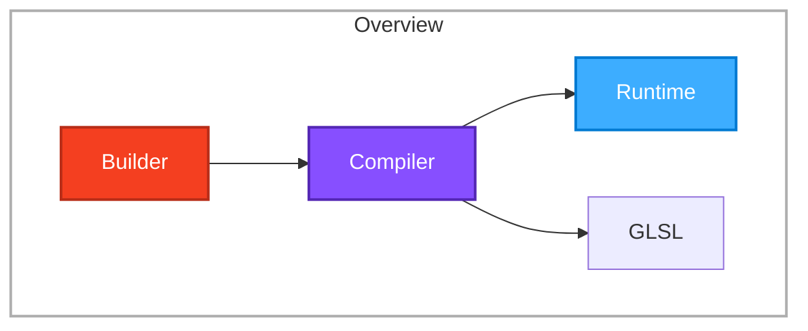
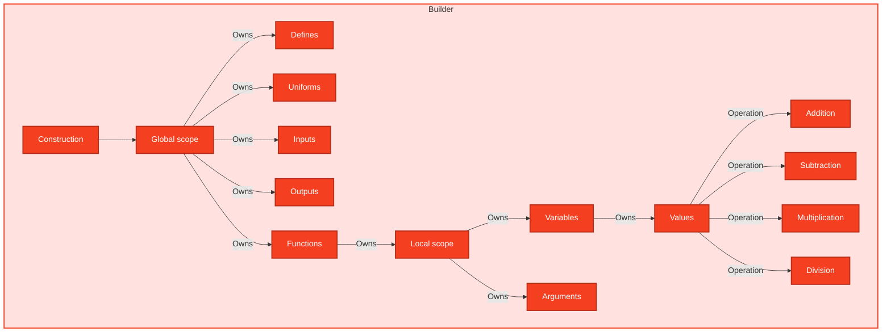

# Library architecture

## Overview

The main idea for this library is very simple: `Builder -> Compiler -> (Runtime | GLSL)`

We use colors to separate each step:

| Index | Name       | Color    |
| ----- | ---------- | -------- |
| `0`   | `Builder`  | `ORANGE` |
| `1`   | `Compiler` | `PURPLE` |
| `2`   | `Runtime`  | `BLUE`   |

Therefore, based on these colors we'd have something like this:



## Builder architecture

In our `Builder` we have a lot of types and systems that are working compatible together



We will use typescript native generators to implement this feature because it would be much more easier for developers to use generator syntax rather than defining OOP objects and relating them together

For example imagine we want to convert the following GLSL code to our syntax

```glsl
uniform vec3 uColor;
uniform float uBrightness;
uniform float uThreshold;

in vec2 vUv;
in vec3 vNormal;

out vec4 fragColor;

void main()
{
    vec3 lightDir = vec3(0.5, 0.8, 1.0);

    float light = max(
        dot(normalize(vNormal), normalize(lightDir)),
        0.0
    );

    vec3 color = uColor * light;
    color *= uBrightness;

    if (vUv.x > uThreshold) {
        color += vec3(0.1, 0.1, 0.1);
    }

    color = clamp(color, 0.0, 1.0);

    fragColor = vec4(color, 1.0);
}
```

the expected syntax is something like this

```ts
const shaderIR = shader(function* () {
  const uColor = yield* uniform(DATATYPE.VEC3).as("uColor");
  const uBrightness = yield* uniform(DATATYPE.FLOAT).as("uBrightness");
  const uThreshold = yield* uniform(DATATYPE.FLOAT).as("uThreshold");

  const vUv = yield* input(DATATYPE.VEC2).as("vUv");
  const vNormal = yield* input(DATATYPE.VEC3).as("vNormal");

  const fragColor = yield* output(DATATYPE.VEC4).as("fragColor");

  return yield* fn(function* () {
    const lightDir = yield* variable(DATATYPE.VEC3)
      .assign(vec3(0.5, 0.8, 1.0))
      .as("lightDir");

    const light = yield* variable(DATATYPE.FLOAT)
      .assign(max(dot(normalize(vNormal), normalize(lightDir)), 0))
      .as("light");

    const color = yield* variable(DATATYPE.VEC3)
      .assign(times(uColor, light))
      .as("color");

    yield* color.assign(times(color, uBrightness));

    yield* if_(gt(vUv.x, uThreshold), function* () {
      yield* color.assign(add(color, vec3(0.1, 0.1, 0.1)));
    });

    yield* color.assign(clamp(color, 0, 1));

    yield* fragColor.assign(vec4(color, 1));
  });
});
```

This idea comes from what [Effect TS generators](https://www.effect.website/docs/v3/onboarding) are doing under the hood and it is simple:

- We will have some types that they extend a general type named `BuilderNode`
- The `BuilderNode` will have a property named `kind` to detect its type and another property named `data` for its data
- Every important part of GLSL will have a type that extends `BuilderNode` for example we will have a function for creating uniforms named `uniform`
