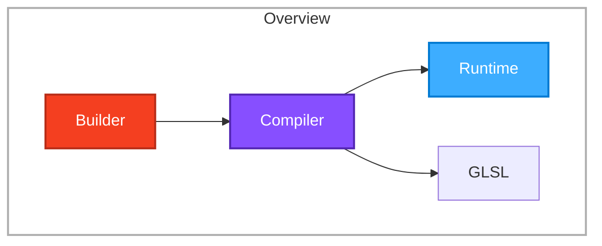
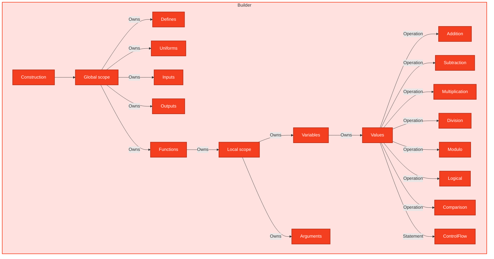

# Library Architecture

## Overview

The main idea for this library is very simple: `Builder → Compiler → (Runtime | GLSL)`

We use colors to separate each step:

| Index | Name       | Color    |
| ----- | ---------- | -------- |
| `0`   | `Builder`  | `ORANGE` |
| `1`   | `Compiler` | `PURPLE` |
| `2`   | `Runtime`  | `BLUE`   |



> **⚠️ Implementation Reality** (see [TODO.md](./TODO.md) for the full checklist):
> The diagram above describes the **target architecture**. The current state:
>
> - ✅ **Builder layer**: ~80% complete — generator wrapping, node system, all core nodes, operations, control flow, type promotion
> - 🚧 **Compiler layer**: ~15% complete — factory exists, GLSL 1.00 compiler emits declarations for uniforms/inputs/outputs, GLSL 3.00 is a stub
> - ❌ **Runtime layer**: Not started

---

## Project Structure (Actual On-Disk Layout)

```text
src/
├── builder/
│   ├── builder.ts           ← Builder class (from_generator, compile)
│   ├── node.ts              ← BuilderNode base, builderNode factory, isBuilderNode
│   ├── name.ts              ← createNameGenerator (hex-prefixed unique names)
│   ├── error.ts             ← Custom errors (InvalidNodeYieldError, InvalidGeneratorMainError)
│   ├── helpers/
│   │   └── node.helper.ts   ← Node utility helpers
│   └── nodes/
│       ├── common.ts        ← IONode base for input/output (shared)
│       ├── uniform.node.ts  ← UniformNode + uniform() factory ✅
│       ├── input.node.ts    ← InputNode + input() factory ✅
│       ├── output.node.ts   ← OutputNode + output() factory ✅
│       ├── main.node.ts     ← MainNode + main() factory ✅
│       ├── function.node.ts ← FunctionNode + fn(), FunctionDefinition fluent API ✅
│       ├── argument.node.ts ← ArgumentNode + argument() factory ✅
│       ├── scope.node.ts    ← ScopeNode + scope() factory ✅
│       ├── value.node.ts    ← ValueNode + value(), VALUE_DATATYPE ✅
│       ├── variable.node.ts ← VariableNode + variable() factory ✅
│       ├── control-flow/    ← if_, for_, while_, do_, switch_ ✅
│       ├── jump/            ← break_, continue_, discard_, return_ ✅
│       ├── logical/         ← and, or, not ✅
│       ├── comparison/      ← eq, neq, lt, lte, gt, gte ✅
│       └── operations/
│           ├── common.ts      ← OperationNode base type
│           ├── addition.node.ts    ← add() ✅
│           ├── subtraction.node.ts ← subtract() ✅
│           ├── multiplication.node.ts ← multiply() ✅
│           ├── division.node.ts  ← divide() ✅
│           ├── modulus.node.ts   ← modulo() ✅
│           └── types/
│               ├── additive.type.ts       ← AdditiveDatatype + AdditiveCombination<L,R>
│               └── multiplicative.type.ts ← MultiplicativeDatatype + MultiplicativeCombination<L,R>
├── compiler/
│   ├── compiler.ts          ← createCompiler factory (context + emit function)
│   ├── context.ts           ← CompilerContext type (datatypeParser)
│   ├── emitter.ts           ← SourceEmitter (line-based source generation)
│   ├── names.ts             ← CompilerNames (unique name tracking)
│   ├── GLSL100.compiler.ts  ← GLSL ES 1.00 compiler (emits attribute/varying/uniform) 🚧
│   └── GLSL300.compiler.ts  ← GLSL ES 3.00 compiler (stub, throws NotImplementedError) ❌
├── structures/
│   ├── vec2.structure.ts    ← vec2, Vec2<T>, isVec2
│   ├── vec3.structure.ts    ← vec3, Vec3<T>, isVec3
│   ├── vec4.structure.ts    ← vec4, Vec4<T>, isVec4
│   ├── matrix2.structure.ts      ← matrix2, Matrix2<T>
│   ├── matrix2x3.structure.ts    ← matrix2x3, Matrix2x3<T>
│   ├── matrix2x4.structure.ts    ← matrix2x4, Matrix2x4<T>
│   ├── matrix3.structure.ts      ← matrix3, Matrix3<T>
│   ├── matrix3x2.structure.ts    ← matrix3x2, Matrix3x2<T>
│   ├── matrix3x4.structure.ts    ← matrix3x4, Matrix3x4<T>
│   ├── matrix4.structure.ts      ← matrix4, Matrix4<T>
│   ├── matrix4x2.structure.ts    ← matrix4x2, Matrix4x2<T>
│   └── matrix4x3.structure.ts    ← matrix4x3, Matrix4x3<T>
├── types.ts                 ← DATATYPE enum + all type groupings & mappings
└── index.ts                 ← Public API exports
```

The `tests/` directory mirrors `src/builder/` and `src/` structure, runs on `vitest`.

---

## Type System

The entire DSL is backed by a numeric datatype registry in `src/types.ts`. Each GLSL type is a constant value, grouped into families, then merged into a single `DATATYPE` object.

```text
DATATYPE (merged registry)
├── SCALAR_DATATYPE        FLOAT(0x00), INT(0x01), UINT(0x02), BOOL(0x03)
├── FLOAT_VEC_DATATYPE     VEC2(0x04), VEC3(0x05), VEC4(0x06)
├── INT_VEC_DATATYPE       INT_VEC2(0x07), INT_VEC3(0x08), INT_VEC4(0x09)
├── UINT_VEC_DATATYPE      UINT_VEC2(0x0a), UINT_VEC3(0x0b), UINT_VEC4(0x0c)
├── BOOL_VEC_DATATYPE      BOOL_VEC2(0x0d), BOOL_VEC3(0x0e), BOOL_VEC4(0x0f)
├── MATRIX_DATATYPE        MATRIX2(0x10), MATRIX3(0x11), MATRIX4(0x12),
│                          MATRIX2x3(0x13), MATRIX2x4(0x14),
│                          MATRIX3x2(0x15), MATRIX3x4(0x16),
│                          MATRIX4x2(0x17), MATRIX4x3(0x18)
└── SAMPLER_DATATYPE       SAMPLER_2D(0x19), INT_SAMPLER_2D(0x1b), UINT_SAMPLER_2D(0x1c),
                           SAMPLER_3D(0x1d), INT_SAMPLER_3D(0x1f), UINT_SAMPLER_3D(0x20),
                           SAMPLER_CUBE(0x21), INT_SAMPLER_CUBE(0x23), UINT_SAMPLER_CUBE(0x24)
```

These values drive two systems:

1. **ValueNode Type Mapping** (`nodes/value.node.ts`): `VALUE_DATATYPE` (all non-sampler types) maps via `DatatypeValueType<T>` to TypeScript runtime shapes:
   - `FLOAT → number`, `INT → number`, `UINT → number`, `BOOL → boolean`
   - `VEC3 → Vec3<number>`, `MATRIX4 → Matrix4<number>` (nested tuples), etc.

2. **Compile-Time Type Promotion** for operations (see [Operation Type Promotion](#operation-type-promotion)).

---

## Builder

### Entry Point & Flow

The `Builder` (`src/builder/builder.ts`) wraps a generator function that yields `BuilderNode` values:

```ts
import { Builder, uniform, DATATYPE } from "shader-generator";

const builder = Builder.from_generator(function* () {
  yield* uniform({ type: DATATYPE.FLOAT });
  // ... more nodes: uniforms, inputs, outputs, operations, etc.
  yield* main(
    (def) => def,
    function* () {
      /* body */
    },
  );
});

const source = builder.compile(GLSL100Compiler); // Currently emits declarations only
```

`Builder.from_generator()`:

1. Iterates the generator, collecting yielded nodes
2. Validates each yield is a `BuilderNode` (via `isBuilderNode`)
3. Requires the final return value to be a `MainNode` (via `isMainNode`)
4. Stores the collected nodes as `BuilderNodes` tuple

`Builder.compile(compiler)` delegates to the compiler's `compile(nodes)` method.

### BuilderNode — Core Traversal Mechanism

Every DSL construct is a `BuilderNode` — a plain object with:

- `kind` — string discriminator (`"uniform"`, `"addition"`, `"if"`, etc.)
- `data` — typed payload (type info, operands, child nodes, etc.)
- `[Symbol.iterator]()` — enables `yield*` delegation

```ts
// src/builder/node.ts
export type BuilderNodeOptions<Kind, Data> = { kind: Kind; data: Data };

export type BuilderNode<Kind = string, Data = unknown> = BuilderNodeOptions<
  Kind,
  Data
> & {
  [Symbol.iterator](): Generator<BuilderNode<Kind, Data>, Data, Data>;
};

export function builderNode<Kind, Data>(
  options: BuilderNodeOptions<Kind, Data>,
): BuilderNode<Kind, Data> {
  return {
    ...options,
    *[Symbol.iterator]() {
      return yield this; // yields itself, then returns its own data
    },
  };
}
```

Factory functions (`uniform()`, `add()`, `if_()`, etc.) call `builderNode({ kind, data })` to construct typed nodes.

### Builder Architecture (Conceptual Model)



### Implementation Status (Per Node Type)

| Concept                 | File                               | Status  | Notes                                                        |
| ----------------------- | ---------------------------------- | ------- | ------------------------------------------------------------ |
| `uniform()`             | `uniform.node.ts`                  | ✅ done | `{ type }`, `.as(name)` aliasing                             |
| `input()` / `output()`  | `input.node.ts` / `output.node.ts` | ✅ done | `.as(name)`, `.flat()` flattening                            |
| `main()`                | `main.node.ts`                     | ✅ done | Shader entry point, requires `FunctionDefinition`            |
| `fn()`                  | `function.node.ts`                 | ✅ done | Fluent `FunctionDefinition` with `withArg()`, `withReturn()` |
| `argument()`            | `argument.node.ts`                 | ✅ done | Used by `FunctionDefinition.withArg`                         |
| `scope()`               | `scope.node.ts`                    | ✅ done | Tracks `nodes`, `args: Set`, `variables: Set`                |
| `value()`               | `value.node.ts`                    | ✅ done | Literal values for all `VALUE_DATATYPE`                      |
| `variable()`            | `variable.node.ts`                 | ✅ done | `.as(name)`, `.assign(value)`                                |
| Arithmetic ops          | `operations/*.ts`                  | ✅ done | `add`, `subtract`, `multiply`, `divide`, `modulo`            |
| Logical ops             | `logical/*.ts`                     | ✅ done | `and`, `or`, `not`                                           |
| Comparison ops          | `comparison/*.ts`                  | ✅ done | `eq`, `neq`, `lt`, `lte`, `gt`, `gte`                        |
| Control flow            | `control-flow/*.ts`                | ✅ done | `if_`, `for_`, `while_`, `do_`, `switch_`                    |
| Jump statements         | `jump/*.ts`                        | ✅ done | `break_`, `continue_`, `discard_`, `return_`                 |
| `createNameGenerator()` | `name.ts`                          | ✅ done | Hex `g_` prefixed names; tested                              |
| `createCounter()`       | `counter.ts`                       | ✅ done | Clamped counter; tested                                      |

**Not yet implemented**: `define()` (preprocessor defines), struct types, array types, precision/interpolation qualifiers, built-in function wrappers (`texture()`, `dot()`, `normalize()`, etc.).

### Operation Type Promotion

Binary operations encode GLSL's type-promotion rules via **type-level lookup maps**:

- `operations/types/additive.type.ts` — `AdditiveCombination<L, R>` map + `AdditiveDatatype` guard
- `operations/types/multiplicative.type.ts` — `MultiplicativeCombination<L, R>` map + `MultiplicativeDatatype` guard

Example: `AdditiveCombination<FLOAT, VEC3>` resolves to `VEC3` at compile time. Runtime guards `isAdditiveDatatype` / `isMultiplicativeDatatype` (backed by `ADDITIVE_DATATYPE` / `MULTIPLICATIVE_DATATYPE` sets) are available for narrowing.

---

## Compiler

### Compiler Factory

`createCompiler()` (`src/compiler/compiler.ts`) takes a context and emit function:

```ts
export type CompilerFactoryOptions = {
  context: CompilerContext; // { datatypeParser: (dt) => string }
  emit: (props: { nodes; emitter; names; context }) => string;
};

export function createCompiler(options: CompilerFactoryOptions): Compiler {
  return {
    compile: (nodes) =>
      options.emit({
        emitter: new SourceEmitter(),
        names: new CompilerNames(),
        nodes,
        context: options.context,
      }),
  };
}
```

### GLSL 1.00 Compiler (`GLSL100Compiler`)

Partially implemented — emits declarations for global nodes:

```ts
// src/compiler/GLSL100.compiler.ts
export const GLSL100Compiler = createCompiler({
  context: {
    datatypeParser: (dt) => {
      /* maps DATATYPE → GLSL string */
    },
  },
  emit: ({ nodes, emitter, names, context }) => {
    for (const node of nodes) {
      switch (node.kind) {
        case "input":
          emitter.line(
            `attribute ${context.datatypeParser(node.data.type)} ${names.getName(node)}`,
          );
          break;
        case "output":
          emitter.line(
            `varying ${context.datatypeParser(node.data.type)} ${names.getName(node)}`,
          );
          break;
        case "uniform":
          emitter.line(
            `uniform ${context.datatypeParser(node.data.type)} ${names.getName(node)}`,
          );
          break;
      }
    }
    return emitter.toString();
  },
});
```

**Supported**: `uniform` → `uniform`, `input` → `attribute`, `output` → `varying`
**Missing**: Function bodies, variable declarations, operations, control flow, assignments, return statements, main function emission.

### GLSL 3.00 Compiler (`GLSL300Compiler`)

Stub only — throws `NotImplementedError` in `datatypeParser` and `emit`.

### What's Missing in Compiler Layer

- Complete GLSL type-name map for all `DATATYPE` values (1.00 has partial, 3.00 has none)
- GLSL ES 1.00 vs 3.00 codegen paths (`attribute`/`varying` vs `in`/`out`, `texture2D` vs `texture`, etc.)
- Node traversal/visitor for function bodies, scopes, variables, operations
- Source emission for: assignments, returns, conditionals (`if`), loops (`for`/`while`/`do`), `switch`, jump statements
- Built-in function emission
- Precision qualifiers (`highp`, `mediump`, `lowp`)
- Uniform blocks / `layout(std140)`

---

## Runtime

The `Runtime` (blue) slot represents a future WebGL binding layer (uniform buffers, vertex arrays, draw calls). **Does not exist in the codebase** — listed only for forward planning.

---

## Vector/Matrix Structures

`src/structures/` provides typed constructors matching GLSL semantics:

| Function                                                         | Signature Highlights                                                                                                            |
| ---------------------------------------------------------------- | ------------------------------------------------------------------------------------------------------------------------------- |
| `vec2<T>(x, y?)`, `vec2<T>([x, y])`                              | Single value replicated, or two scalars                                                                                         |
| `vec3<T>(x, y?, z?)`, `vec3<T>(x, [y, z])`, `vec3<T>([x, y], z)` | Flexible: scalar, scalar+Vec2, Vec2+scalar, three scalars                                                                       |
| `vec4<T>(...)`                                                   | 8 overloads: scalar, scalar+Vec3, Vec3+scalar, 2×Vec2, scalar+scalar+Vec2, scalar+Vec2+scalar, Vec2+scalar+scalar, four scalars |
| `matrix2`...`matrix4x3`                                          | Column-major from row vectors (matching GLSL constructor semantics)                                                             |

All include type guards (`isVec2`, `isVec3`, `isVec4`).

---

## Testing

Project uses `vitest` (`npm test`). Tests under `tests/`:

| File                                   | Covers                                    | Status                          |
| -------------------------------------- | ----------------------------------------- | ------------------------------- |
| `tests/counter.test.ts`                | `createCounter()`                         | ✅ passing (clamping, skipping) |
| `tests/builder/name.test.ts`           | `createNameGenerator()`                   | ✅ uniqueness + skip offsets    |
| `tests/builder/node.test.ts`           | `builderNode` `Symbol.iterator`           | ✅ minimal                      |
| `tests/builder/uniform.test.ts`        | `uniform().as()`                          | ✅                              |
| `tests/builder/input.test.ts`          | `input().as()`, `.flat()`                 | ✅                              |
| `tests/builder/output.test.ts`         | `output().as()`, `.flat()`                | ✅                              |
| `tests/builder/function.test.ts`       | `FunctionDefinition` fluent API           | ✅                              |
| `tests/builder/variable.test.ts`       | `variable().as()`, `.assign()`            | ✅                              |
| `tests/builder/addition.test.ts`       | `add()` operation                         | ✅                              |
| `tests/builder/scope.test.ts`          | `scope()` node                            | ✅                              |
| `tests/builder/main.test.ts`           | `main()` node                             | ✅                              |
| `tests/builder/control-flow/*.test.ts` | `if_`, `for_`, `while_`, `do_`, `switch_` | ✅ (4-5 tests each)             |
| `tests/structures/*.test.ts`           | `matrix2`...`matrix4x3` factories         | ✅                              |

**Gaps**: No compiler output/snapshot tests, no builder integration tests (full shader → GLSL), no type-promotion unit tests.

---

## Configuration

| Tool           | Config             | Purpose                                                                                                                     |
| -------------- | ------------------ | --------------------------------------------------------------------------------------------------------------------------- |
| **tsup**       | `tsup.config.ts`   | ESM + CJS bundles with declarations from `src/index.ts`                                                                     |
| **TypeScript** | `tsconfig.json`    | `strict`, `verbatimModuleSyntax`, `exactOptionalPropertyTypes`, `noUncheckedIndexedAccess`, `module: nodenext`, `types: []` |
| **Prettier**   | `.prettierrc`      | + `@trivago/prettier-plugin-sort-imports`, `prettier-plugin-sort-re-exports`                                                |
| **Vitest**     | `vitest.config.ts` | Test runner                                                                                                                 |

---

## Key Design Principles

1. **Describe once, compile for target** — Builder describes _what_ the shader needs; Compiler decides _how_ to express it in target GLSL version.

2. **Nodes as values** — Every construct is a `BuilderNode` (plain object + `Symbol.iterator`), enabling composition via `yield*`.

3. **Type-level GLSL semantics** — Type promotion maps (`AdditiveCombination`, `MultiplicativeCombination`) encode GLSL rules in TypeScript types.

4. **Generator-based IR collection** — Builder uses generator iteration (not AST transformation) to collect the intermediate representation.

5. **Separation of concerns** — Builder knows nothing about GLSL syntax; Compiler knows nothing about API ergonomics.
