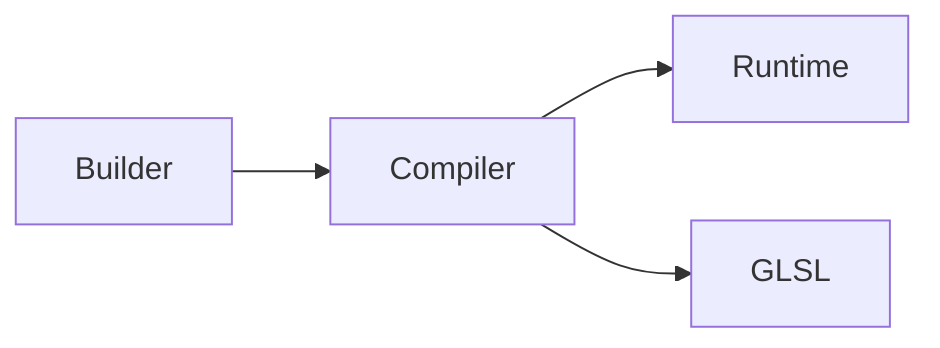

# Library architecture

## Overview

The main idea for this library is very simple: `Builder -> Compiler -> (Runtime | GLSL)`

```mermaid
graph LR;
  Builder-->Compiler
  Compiler-->Runtime
  Compiler-->GLSL
```
