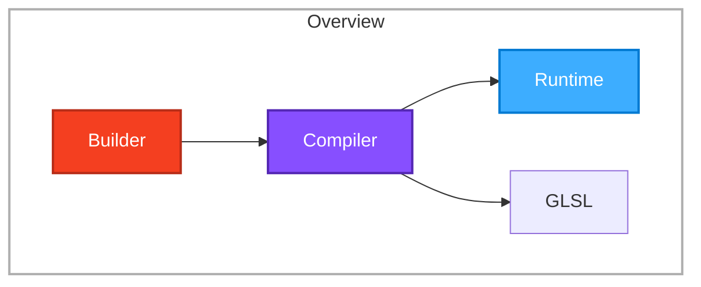
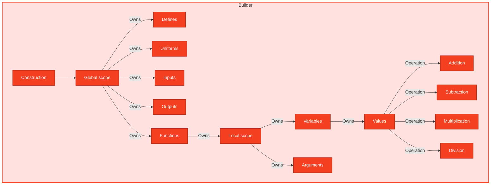

# Library architecture

## Overview

The main idea for this library is very simple: `Builder -> Compiler -> (Runtime | GLSL)`

We use colors to separate each step:

| Index | Name       | Color    |
| ----- | ---------- | -------- |
| `0`   | `Builder`  | `ORANGE` |
| `1`   | `Compiler` | `PURPLE` |
| `2`   | `Runtime`  | `BLUE`   |

Therefore, based on these colors we'd have something like this:

## Builder architecture

In our `Builder` we have a lot of types and systems that are working compatible together

We will use typescript native generators to implement this feature because it would be much more easier for developers to use generator syntax rather than defining OOP objects and relating them together
