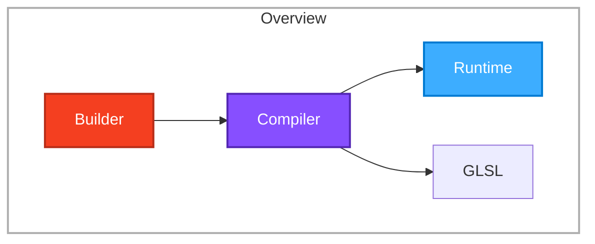
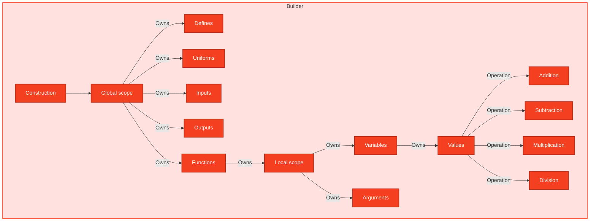

# Library architecture

## Overview

The main idea for this library is very simple: `Builder -> Compiler -> (Runtime | GLSL)`

We use colors to separate each step:

| Index | Name       | Color    |
| ----- | ---------- | -------- |
| `0`   | `Builder`  | `ORANGE` |
| `1`   | `Compiler` | `PURPLE` |
| `2`   | `Runtime`  | `BLUE`   |

Therefore, based on these colors we'd have something like this:



> **⚠️ Implementation reality (see [TODO.md](./TODO.md) for the full status):**
> The diagram above describes the _target_ architecture. At the current state of the
> codebase the pipeline is **not end-to-end** — only a slice of the Builder layer is
> implemented and the Compiler layer is entirely empty stubs. Concretely:
>
> - The `Builder` exists and can wrap a generator, but `Builder.build(target)`
>   throws `NotImplementedError` — no compilation happens yet.
> - The Compiler layer (`WebGLCompiler`, `WebGL2Compiler`) is empty classes with no
>   GLSL emission logic.
> - There is no Runtime layer yet.

---

## Project structure

This is the actual on-disk layout (generated GLSL output is the eventual goal of the
Compiler layer, not yet wired up):

```text
src/
├── builder/
│   ├── builder.ts          ← Builder class (wraps a generator; build() is a stub)
│   ├── index.ts            ← re-exports Builder
│   ├── name.ts             ← createNameGenerator() — unique hex name generator
│   ├── node.ts             ← BuilderNode / builderNode() factory / Symbol.iterator core
│   └── nodes/
│       ├── common.ts       ← IONode base for input/output nodes
│       ├── global.node.ts  ← GlobalNode / createGlobalNode()
│       ├── uniform.node.ts ← UniformNode + uniform() factory ✅ implemented
│       ├── input.node.ts   ← InputNode type only (no factory function) ❌
│       ├── output.node.ts  ← OutputNode type only (no factory function) ❌
│       ├── define.node.ts  ← DefineNode type only (no factory function) ❌
│       ├── main.node.ts    ← MainFunctionNode alias
│       ├── function.node.ts← FunctionNode, FunctionDefinition fluent API
│       ├── argument.node.ts← ArgumentNode + createArgumentNode()
│       ├── scope.node.ts   ← ScopeNode + createScopeNode()
│       ├── variable.node.ts← VariableNode type only (no factory function) ❌
│       ├── value.node.ts   ← ValueNode + ValueDataType + DatatypeValueType<T> (type only, no factory) ❌
│       └── operations/
│           ├── common.ts      ← OperationNode base type
│           ├── addition.node.ts    ← add() ✅
│           ├── subtraction.node.ts ← subtract() ✅
│           ├── multiplication.node.ts ← multiply() ✅
│           ├── division.node.ts  ← divide() ✅
│           ├── modulus.node.ts   ← modulo() ✅
│           └── types/
│               ├── additive.type.ts       ← AdditiveDatatype + AdditiveCombination<L,R> map
│               └── multiplicative.type.ts ← MultiplicativeDatatype + MultiplicativeCombination<L,R> map
├── compiler/
│   ├── compiler.ts          ← abstract Compiler (empty) ❌
│   ├── index.ts             ← BuildTarget ("webgl" | "webgl2") + AVAILABLE_COMPILERS
│   ├── webgl.compiler.ts    ← WebGLCompiler extends Compiler (empty) ❌
│   └── webgl2.compiler.ts   ← WebGL2Compiler extends Compiler (empty) ❌
├── counter.ts               ← createCounter() — clamped counter generator
├── errors.ts                ← NotImplementedError
├── helpers/
│   ├── object.helper.ts     ← values, omit, entries, valuesInclude, ObjectValues
│   └── set.helper.ts        ← addToSet
├── types.ts                 ← DATATYPE enum + all GLSL type groupings & mappings
└── index.ts                 ← public API surface
```

The `tests/` directory mirrors this under `tests/builder/` and `tests/`, and runs on
`vitest`. See [Testing](#testing) below.

---

## Type system

The entire DSL is backed by a bitmask-style datatype registry in `src/types.ts`. Each
GLSL type is a constant numeric value, grouped into families, then merged into a single
`DATATYPE` object.

```sh
DATATYPE (merged registry)
├── SCALAR_DATATYPE        FLOAT, INT, UINT, BOOL
├── FLOAT_VEC_DATATYPE     VEC2, VEC3, VEC4
├── INT_VEC_DATATYPE       INT_VEC2, INT_VEC3, INT_VEC4
├── UINT_VEC_DATATYPE      UINT_VEC2, UINT_VEC3, UINT_VEC4
├── BOOL_VEC_DATATYPE      BOOL_VEC2, BOOL_VEC3, BOOL_VEC4
├── MATRIX_DATATYPE        MATRIX2..4, MATRIX2x3, 2x4, 3x2, 3x4, 4x2, 4x3
└── SAMPLER_DATATYPE       SAMPLER_2D/3D/CUBE + int/uint variants
```

These numeric values drive two things:

1. **The `ValueNode` type mapping** (`nodes/value.node.ts`): a `ValueDataType` union
   (everything _except_ samplers, since samplers can't be values) is mapped through
   `DatatypeValueType<T>` to the corresponding TypeScript runtime shape
   (`FLOAT → number`, `VEC3 → Vec3<number>`, `BOOL → boolean`, matrices → nested tuples,
   etc.).

2. **Compile-time type promotion** for operations (see
   [Operation type promotion](#operation-type-promotion)).

The matrix helper types (`Matrix2`, `Matrix2x3`, `Vec4<Vec4<T>>`, etc.) live in `types.ts`
as nested tuple aliases and are used by `DatatypeValueType`.

---

## Builder

### Entry point & flow

The `Builder` (`src/builder/builder.ts`) is the orchestrator. A shader is described as a
generator function that yields `BuilderNode` values, and the builder wraps that generator:

```ts
import { Builder } from "shader-generator";
import { uniform } from "shader-generator/builder/nodes/uniform.node";

const builder = Builder.from_generator(function* () {
  yield* uniform({ type: DATATYPE.FLOAT });
  // ... more nodes
});

// Not yet implemented — throws NotImplementedError
builder.build("webgl");
```

`Builder.build(target)` is where a `BuildTarget` ("webgl" | "webgl2") selects the
compiler, but the body is currently a stub that throws `NotImplementedError`. The
generator-traversal step that would walk the yielded nodes and feed them to the compiler
does not exist yet.

### BuilderNode — the core traversal mechanism

Every construct in the DSL is a `BuilderNode`. A node is a plain object with a `kind`
discriminator and a `data` payload, plus a `[Symbol.iterator]` implementation so it can be
`yield*`-ed inside a builder generator:

```ts
// src/builder/node.ts
export type BuilderNodeOptions<Kind, Data> = {
  kind: Kind;
  data: Data;
};

export type BuilderNode<Kind = string, Data = unknown> = BuilderNodeOptions<
  Kind,
  Data
> & {
  [Symbol.iterator](): Generator<BuilderNode<Kind, Data>, Data, Data>;
};

export function builderNode<Kind, Data>(
  options: BuilderNodeOptions<Kind, Data>,
): BuilderNode<Kind, Data> {
  return {
    ...options,
    *[Symbol.iterator]() {
      return yield this; // yields itself, then returns its own data
    },
  };
}
```

The pattern is:

- `kind` — a string tag (`"uniform"`, `"function"`, `"addition"`, ...) used by the
  compiler (eventually) to dispatch compilation of each node type.
- `data` — the node's payload (type info, operands, child nodes, etc.).
- `[Symbol.iterator]` — lets a node be used with `yield*` inside a generator so the
  builder can collect it. The iterator yields the node itself and returns its `data`.

Factory functions (`uniform()`, `createArgumentNode()`, `createFunctionNode()`, etc.)
call `builderNode({ kind, data })` to construct typed nodes.

### Builder architecture (conceptual)

In the `Builder` we have a lot of types and systems that are working compatible together.
The conceptual model (this is the _target_ design; the current implementation is a subset):



This idea comes from what [Effect TS generators](https://www.effect.website/docs/v3/onboarding)
are doing under the hood and it is simple.

### What is actually implemented today

Only a subset of the nodes above have concrete factory functions. The rest exist as
**type-only stubs** (the type is exported, but there is no `create*` / named factory that
produces a `builderNode`):

| Concept                                                         | File               | Status  | Notes                                                             |
| --------------------------------------------------------------- | ------------------ | ------- | ----------------------------------------------------------------- |
| `uniform()`                                                     | `uniform.node.ts`  | ✅ done | Takes `{ type }`; no `.as(name)` yet                              |
| `add()` / `subtract()` / `multiply()` / `divide()` / `modulo()` | `operations/*`     | ✅ done | `modulo` is untyped (no `Additive`/`Multiplicative` constraint)   |
| `createArgumentNode()`                                          | `argument.node.ts` | ✅ done | Used by `FunctionDefinition.withArg`                              |
| `createFunctionNode()`                                          | `function.node.ts` | ✅ done | Plus `FunctionDefinition` fluent builder (`withArg`/`withReturn`) |
| `createScopeNode()`                                             | `scope.node.ts`    | ✅ done | Tracks `nodes`, `args: Set`, `variables: Set`                     |
| `createGlobalNode()`                                            | `global.node.ts`   | ✅ done | Stores `defines` & `uniforms` arrays only                         |
| `createNameGenerator()`                                         | `name.ts`          | ✅ done | Hex `g_` prefixed names; tested                                   |
| `createCounter()`                                               | `counter.ts`       | ✅ done | Clamped counter; tested                                           |
| `input()` / `output()` / `define()` / `variable()` / `value()`  | various            | ❌ stub | Type exists, **no factory function**                              |

### Operation type promotion

The binary operations encode GLSL's type-promotion rules in TypeScript via **type-level
lookup maps** (`operations/types/additive.type.ts`, `multiplicative.type.ts`). For each
operand datatype there is a map from the other operand's datatype to the _result_ datatype.
`AdditiveCombination<L, R>` and `MultiplicativeCombination<L, R>` read that map at compile
time, so e.g. `add(FLOAT, VEC3)` resolves to `VEC3` purely through types. Runtime guards
`isAdditiveDatatype` / `isMultiplicativeDatatype` (backed by the `ADDITIVE_DATATYPE` /
`MULTIPLICATIVE_DATATYPE` sets) are available for narrowing.

### Builder API example (proposed vs. current)

The following GLSL:

```glsl
uniform vec3 uColor;
uniform float uBrightness;
uniform float uThreshold;

in vec2 vUv;
in vec3 vNormal;

out vec4 fragColor;

void main()
{
    vec3 lightDir = vec3(0.5, 0.8, 1.0);
    float light = max(dot(normalize(vNormal), normalize(lightDir)), 0.0);
    vec3 color = uColor * light;
    color *= uBrightness;
    if (vUv.x > uThreshold) {
        color += vec3(0.1, 0.1, 0.1);
    }
    color = clamp(color, 0.0, 1.0);
    fragColor = vec4(color, 1.0);
}
```

is _envisioned_ as (this is the aspirational fluent API — most pieces are not implemented):

```ts
const shaderIR = shader(function* () {
  const uColor = yield* uniform(DATATYPE.VEC3).as("uColor");
  const uBrightness = yield* uniform(DATATYPE.FLOAT).as("uBrightness");
  const uThreshold = yield* uniform(DATATYPE.FLOAT).as("uThreshold");

  const vUv = yield* input(DATATYPE.VEC2).as("vUv");
  const vNormal = yield* input(DATATYPE.VEC3).as("vNormal");

  const fragColor = yield* output(DATATYPE.VEC4).as("fragColor");

  return yield* fn(function* () {
    const lightDir = yield* variable(DATATYPE.VEC3)
      .assign(vec3(0.5, 0.8, 1.0))
      .as("lightDir");

    const light = yield* variable(DATATYPE.FLOAT)
      .assign(max(dot(normalize(vNormal), normalize(lightDir)), 0))
      .as("light");

    const color = yield* variable(DATATYPE.VEC3)
      .assign(times(uColor, light))
      .as("color");

    yield* color.assign(times(color, uBrightness));

    yield* if_(gt(vUv.x, uThreshold), function* () {
      yield* color.assign(add(color, vec3(0.1, 0.1, 0.1)));
    });

    yield* color.assign(clamp(color, 0, 1));

    yield* fragColor.assign(vec4(color, 1));
  });
});
```

The mechanics the design relies on:

- We have some types that extend a general type named `BuilderNode`.
- The `BuilderNode` has a `kind` discriminator (to identify its type at compile/encode time)
  and a `data` payload (its actual information).
- Every important part of GLSL has a `kind` and a corresponding node: `uniform`,
  `input`, `output`, `define`, `function`, `argument`, `variable`, `value`, and the
  operation kinds (`addition`, `subtraction`, `multiplication`, `division`, `modulus`).
- Nodes are constructed via `builderNode({ kind, data })` and used inside `yield*`
  generator expressions so the builder can collect them.

The above vision is **not yet realized** in full — see the implementation matrix. The public
API surface (`src/index.ts`) currently only exports `Builder`, `uniform`, and the five
operation functions (`add`, `subtract`, `multiply`, `divide`, `modulo`).

---

## Compiler

The Compiler layer is the second stage of the pipeline. Its job is to walk the
`BuilderNode` tree produced by the Builder and emit GLSL for the chosen target.

```ts
// src/compiler/index.ts
export const AVAILABLE_COMPILERS = {
  webgl: WebGLCompiler,
  webgl2: WebGL2Compiler,
} as const;

export type BuildTarget = keyof typeof AVAILABLE_COMPILERS; // "webgl" | "webgl2"
```

| Class                 | File                 | Status                                                       |
| --------------------- | -------------------- | ------------------------------------------------------------ |
| `Compiler` (abstract) | `compiler.ts`        | ❌ empty — `export abstract class Compiler {}`               |
| `WebGLCompiler`       | `webgl.compiler.ts`  | ❌ empty — `export class WebGLCompiler extends Compiler {}`  |
| `WebGL2Compiler`      | `webgl2.compiler.ts` | ❌ empty — `export class WebGL2Compiler extends Compiler {}` |

What's **missing** in the compiler layer:

- A GLSL type-name map (`DATATYPE` value → `"float"`, `"vec3"`, `"uint"`, `"mat2x3"`, etc.)
- A GLSL ES 1.00 vs 3.00 codegen path (version differences: `texture2D` vs `texture`,
  `attribute`/`varying` vs `in`/`out`, no-`uint` support, etc.)
- Any node traversal / visitor that consumes the nodes the Builder produces
- Source emission for uniforms, inputs/outputs, functions, variables, scopes, operations,
  assignments, returns, conditionals (`if`), loops (`for`/`while`), etc.

In short: the Compiler is **designed but not implemented**. There is no GLSL output yet.

---

## Runtime

The `Runtime` (blue) slot in the Overview represents a future execution/runtime stage
(e.g. a WebGL binding that takes compiled source and manages uniform buffers, vertex
arrays, etc.). **It does not exist in the codebase.** It is listed only as a pipeline
destination in the Overview for forward-planning purposes.

---

## Testing

The project uses [`vitest`](https://vitest.dev) (`npm test`). Tests live under `tests/`:

| File                         | Covers                          | Status                                                                      |
| ---------------------------- | ------------------------------- | --------------------------------------------------------------------------- |
| `tests/counter.test.ts`      | `createCounter()`               | ✅ passing (clamping, skipping)                                             |
| `tests/builder/name.test.ts` | `createNameGenerator()`         | ✅ uniqueness + skip offsets                                                |
| `tests/builder/node.test.ts` | `builderNode` `Symbol.iterator` | ✅ minimal — only checks iterator exists                                    |
| `tests/variable.test.ts`     | `VariableNode` creation         | ❌ **placeholder** — body is `undefined as any`; marked `TODO: Complete it` |

Gaps:

- No tests for the five operations (`add`, `subtract`, ...).
- No tests for `uniform()`, `createFunctionNode()`, `createArgumentNode()`, scopes.
- No type-promotion tests for `AdditiveCombination` / `MultiplicativeCombination`.
- No compiler output / snapshot tests (nothing to snapshot yet).
- No builder integration test (full shader → build → GLSL).

> Note: `name.test.ts` calls `nameGenerator.take(99999).toArray()` on a native
> `Generator` object. No library in the dependency tree provides `take`/`toArray` on
> generators, so that assertion may rely on an external/global polyfilled extension; this
> should be verified when the test runner is exercised.

---

## Configuration

- **Bundler/build**: [`tsup`](https://tsup.xsoto.io) — `tsup.config.ts` emits ESM + CJS
  bundles with declarations from `src/index.ts`.
- **Type checking**: `tsc --noEmit` (`npm run typecheck`), configured in `tsconfig.json`
  with `strict`, `verbatimModuleSyntax`, `exactOptionalPropertyTypes`,
  `noUncheckedIndexedAccess`. `module` is `nodenext`, `types` is `[]` (no Node types
  included), and there is no `lib` override (defaults to `esnext` via `target`).
- **Formatting**: `.prettierrc` + `@trivago/prettier-plugin-sort-imports`.
